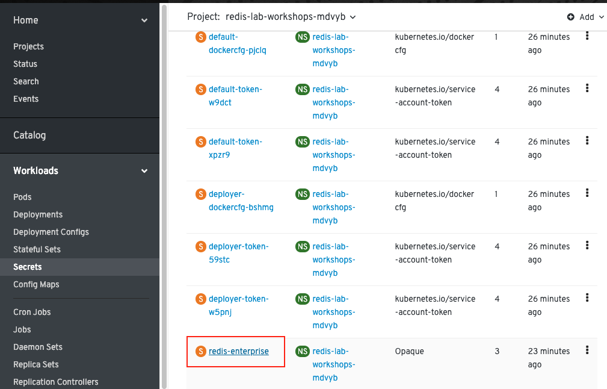
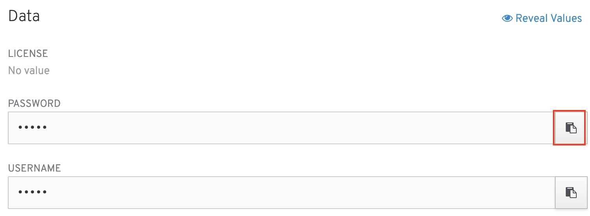

To create a database, we first need to get the password value from the "redis-enterprise" secret.

Click the Console tab above the terminal windows. In the left-hand navigation, click Workloads > Secrets. In the list of Secrets, find "redis-enterprise" and click on it. 



Scroll down the page until you see the Data section. Click the copy to clipboard icon next to the password field. 



Switch back to the Terminal tab and run the following command to get a shell into the `redis-enterprise-0` pod:

```execute-1
oc exec -it redis-enterprise-0 bash
```

Next, enter the following command into the top terminal, but replace YOUR_PASSWORD with the password value you copied on the Secrets page:

```
export PW=YOUR_PASSWORD
```
Then execute the following to create a database:

```execute-1
curl -k -i -u "admin@acme.com:$PW" --request POST --url "https://localhost:9443/v1/bdbs" --header 'content-type: application/json' --data '{"name":"sample-db","type":"redis","memory_size":1073741824,"port":12000}'
```

You should receive a response that looks something like this:
```
HTTP/1.1 200 OK
Server: nginx
Date: Mon, 01 Apr 2019 18:31:46 GMT
Content-Type: application/json
Content-Length: 2168
Connection: keep-alive
cluster-state-id: 11

{
  "acl": [],
  "action_uid": "7027912c-0bf4-4870-ab2f-137c177cd1d9",
  "aof_policy": "appendfsync-every-sec",
  "authentication_admin_pass": "B5XpDGQip0PIjG2y9NV28O2Hw5uZR0FlgtC4NwknJ3vTKtdz",
  "authentication_redis_pass": "",
  "authentication_sasl_pass": "",
  ...
}
```

Confirm that it worked by running the following command to list the available services. 

```execute-2
oc get services
```
You should see `sample-db` and `sample-db-headless` in the list of services.
```
NAME                  TYPE           CLUSTER-IP       EXTERNAL-IP                     PORT(S)             AGE
redis-enterprise      ClusterIP      None             <none>                          9443/TCP,8001/TCP   9m
redis-enterprise-ui   LoadBalancer   172.30.167.222   172.29.182.115,172.29.182.115   8443:30278/TCP      9m
sample-db             ClusterIP      172.30.161.16    <none>                          12000/TCP           2m
sample-db-headless    ClusterIP      None             <none>                          12000/TCP           2m
```

Back in the top terminal window, execute the following replacing CLUSTER_IP with the IP address you just copied:

```
export REDIS_IP=CLUSTER_IP
```

Then, use the `redis-cli` command to connect to your database and set and retrieve a value to confirm that it's working:

```execute-1
redis-cli -h $REDIS_IP -p 12000 set a 1
```

```execute-1
redis-cli -h $REDIS_IP -p 12000 get a
```

Your output should look similar to this:

```
bash-4.2$ redis-cli -h $REDIS_IP -p 12000 set a 1
OK
bash-4.2$ redis-cli -h $REDIS_IP -p 12000 get a
"1"
```

